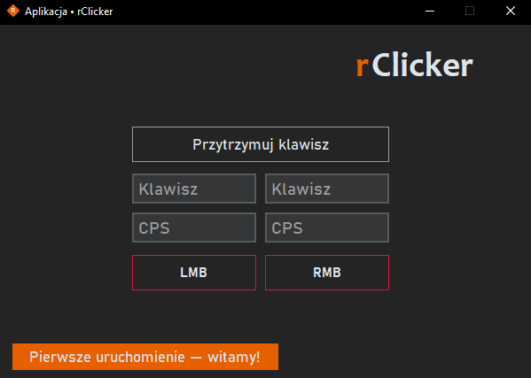

# rClicker - Polski AutoClicker

**rClicker** to polski, autorski auto-clicker dla systemu Windows, stworzony z myślą o graczach. Dzięki niemu możesz cieszyć się wysokim poziomem personalizacji oraz pełnym wsparciem dla wszystkich aplikacji na Windows. Oprogramowanie jest napisane w Pythonie i zapewnia prostą, intuicyjną obsługę.

## Kluczowe funkcje

| Funkcja | Opis |
|---------|------|
| Pełna personalizacja | Dostosuj ustawienia do własnych potrzeb |
| Stworzony dla graczy | Idealne wsparcie w grach wymagających szybkiego klikania |
| Obsługa prawego i lewego przycisku myszy | Możliwość wyboru przycisku do klikania |
| Szybkość klikania | Możliwość ustawienia od 1 do 1000 CPS |
| Tryby aktywacji | Klikanie po naciśnięciu lub przytrzymaniu przycisku |
| Kompatybilność | Działa we wszystkich aplikacjach na Windows |

## Pobieranie i instalacja

1. Pobierz najnowszą wersję **rClicker** z [releases](https://github.com/mcAnanas/rClicker/releases).
2. Uruchom `rClicker.exe`.
3. Program jest gotowy do użycia.

## Konfiguracja

Po uruchomieniu programu możesz dostosować następujące ustawienia:
- **Przycisk aktywacji** – wybierz, który klawisz uruchamia auto-clicker.
- **Liczba kliknięć na sekundę (CPS)** – ustaw od 1 do 1000 CPS.
- **Tryb działania** – wybierz między kliknięciem a przytrzymaniem.

Po pierwszym uruchomieniu programu zostanie utworzony plik o nazwie „Ustawienia”, który będzie przechowywał zaszyfrowane preferencje użytkownika. Dzięki temu przy każdym uruchomieniu **rClicker** nie musisz ponownie ustawiać swoich preferencji.

## Licencja

rClicker jest darmowy do użytku, ale nie wolno go modyfikować ani dekompilować. Szczegóły znajdziesz w pliku [LICENSE.md](./LICENSE.md).

## Wsparcie i kontakt

Masz pytania lub chcesz zgłosić błąd? Skontaktuj się ze mną na Discordzie: **@mcananas**

---
**rClicker – prosty i skuteczny auto-clicker dla każdego!**

---
